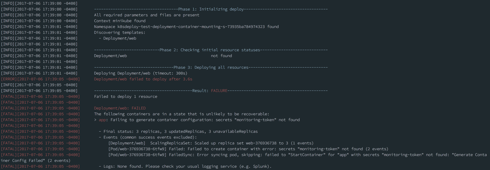
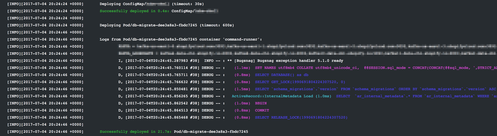

# krane

As this project approaches the v1.0 milestone, we're excited to announce that `kubernetes-deploy` will be [officially renamed as `krane`](https://github.com/Shopify/kubernetes-deploy/issues/30#issuecomment-468750341). Follow the [1.0 requirement label](https://github.com/Shopify/kubernetes-deploy/issues?q=is%3Aissue+is%3Aopen+label%3A%22%3Arocket%3A+1.0+requirement%22) to keep up with the progress.

# kubernetes-deploy [](https://buildkite.com/shopify/kubernetes-deploy) [](https://codecov.io/gh/Shopify/kubernetes-deploy)

`kubernetes-deploy` is a command line tool that helps you ship changes to a Kubernetes namespace and understand the result. At Shopify, we use it within our much-beloved, open-source [Shipit](https://github.com/Shopify/shipit-engine#kubernetes) deployment app.

Why not just use the standard `kubectl apply` mechanism to deploy? It is indeed a fantastic tool; `kubernetes-deploy` uses it under the hood! However, it leaves its users with some burning questions: _What just happened?_ _Did it work?_

Especially in a CI/CD environment, we need a clear, actionable pass/fail result for each deploy. Providing this was the foundational goal of `kubernetes-deploy`, which has grown to support the following core features:

​:eyes:  Watches the changes you requested to make sure they roll out successfully.

:interrobang: Provides debug information for changes that failed.

:1234:  Predeploys certain types of resources (e.g. ConfigMap, PersistentVolumeClaim) to make sure the latest version will be available when resources that might consume them (e.g. Deployment) are deployed.

:closed_lock_with_key:  [Creates Kubernetes secrets from encrypted EJSON](#deploying-kubernetes-secrets-from-ejson), which you can safely commit to your repository

​:running: [Running tasks at the beginning of a deploy](#running-tasks-at-the-beginning-of-a-deploy) using bare pods (example use case: Rails migrations)

This repo also includes related tools for [running tasks](#kubernetes-run) and [restarting deployments](#kubernetes-restart).





--------


## Table of contents

**KUBERNETES-DEPLOY**
* [Prerequisites](#prerequisites)
* [Installation](#installation)
* [Usage](#usage)
  * [Using templates and variables](#using-templates-and-variables)
  * [Customizing behaviour with annotations](#customizing-behaviour-with-annotations)
  * [Running tasks at the beginning of a deploy](#running-tasks-at-the-beginning-of-a-deploy)
  * [Deploying Kubernetes secrets (from EJSON)](#deploying-kubernetes-secrets-from-ejson)
  * [Deploying custom resources](#deploying-custom-resources)

**KUBERNETES-RESTART**
* [Usage](#usage-1)

**KUBERNETES-RUN**
* [Prerequisites](#prerequisites-1)
* [Usage](#usage-2)

**KUBERNETES-RENDER**
* [Prerequisites](#prerequisites-2)
* [Usage](#usage-3)

**CONTRIBUTING**
* [Contributing](#contributing)
* [Code of Conduct](#code-of-conduct)
* [License](#license)


----------


## Prerequisites

* Ruby 2.3+
* Your cluster must be running Kubernetes v1.11.0 or higher<sup>1</sup>
* Each app must have a deploy directory containing its Kubernetes templates (see [Templates](#using-templates-and-variables))

<sup>1</sup> We run integration tests against these Kubernetes versions. You can find our
official compatibility chart below.

| Kubernetes version | Last officially supported in gem version |
| :----------------: | :-------------------: |
|        1.5         |        0.11.2         |
|        1.6         |        0.15.2         |
|        1.7         |        0.20.6         |
|        1.8         |        0.21.1         |
|        1.9         |        0.24.0         |
|        1.10        |        0.27.0         |

## Installation

1. [Install kubectl](https://kubernetes.io/docs/tasks/tools/install-kubectl/#install-kubectl-binary-via-curl) (requires v1.11.0 or higher) and make sure it is available in your $PATH
2. Set up your [kubeconfig file](https://kubernetes.io/docs/tasks/access-application-cluster/authenticate-across-clusters-kubeconfig/) for access to your cluster(s).
3. `gem install kubernetes-deploy`


## Usage

`kubernetes-deploy <app's namespace> <kube context>`

*Environment variables:*

- `$REVISION`: the SHA of the commit you are deploying. Will be exposed to your ERB templates as `current_sha`.
- `$KUBECONFIG`: points to one or multiple valid kubeconfig files that include the context you want to deploy to. File names are separated by colon for Linux and Mac, and semi-colon for Windows. If ommitted, will use the Kubernetes default of `~/.kube/config`.
- `$TASK_ID`: used as the ID of the deployment for resource naming.
- `$ENVIRONMENT`: used to set the deploy directory to `config/deploy/$ENVIRONMENT`. You can use the `--template-dir=DIR` option instead if you prefer (**one or the other is required**).
- `$GOOGLE_APPLICATION_CREDENTIALS`: points to the credentials for an authenticated service account (required if your kubeconfig `user`'s auth provider is GCP)


*Options:*

Refer to `kubernetes-deploy --help` for the authoritative set of options.

- `--template-dir=DIR`: Used to set the deploy directory. Set `$ENVIRONMENT` instead to use `config/deploy/$ENVIRONMENT`. This flag also supports reading from STDIN. You can do this by using `--template-dir=-`. Example: `cat templates_from_stdin/*.yml | kubernetes-deploy ns ctx --template-dir=-`.
- (alpha feature) `-f [PATHS]`: Accepts a comma-separated list of directories and/or filenames to specify the set of directories/files that will be deployed (use `-` to read from STDIN). Can be invoked multiple times. Cannot be combined with `--template-dir`. Example: `cat templates_from_stdin/*.yml | kubernetes-deploy ns ctx -f -,path/to/dir,path/to/file.yml`
- `--bindings=BINDINGS`: Makes additional variables available to your ERB templates. For example, `kubernetes-deploy my-app cluster1 --bindings=color=blue,size=large` will expose `color` and `size`.
- `--no-prune`: Skips pruning of resources that are no longer in your Kubernetes template set. Not recommended, as it allows your namespace to accumulate cruft that is not reflected in your deploy directory.
- `--max-watch-seconds=seconds`: Raise a timeout error if it takes longer than _seconds_ for any
resource to deploy.
- `--selector`: Instructs kubernetes-deploy to only prune resources which match the specified label selector, such as `environment=staging`. If you use this option, all resource templates must specify matching labels. See [Sharing a namespace](#sharing-a-namespace) below.

> **NOTICE**: Deploy Secret resources at your own risk. Although we will fix any reported leak vectors with urgency, we cannot guarantee that sensitive information will never be logged.

### Sharing a namespace

By default, kubernetes-deploy will prune any resources in the target namespace which have the `kubectl.kubernetes.io/last-applied-configuration` annotation and are not a result of the current deployment process, on the assumption that there is a one-to-one relationship between application deployment and namespace, and that a deployment provisions all relevant resources in the namespace.

If you need to, you may specify `--no-prune` to disable all pruning behaviour, but this is not recommended.

If you need to share a namespace with resources which are managed by other tools or indeed other kubernetes-deploy deployments, you can supply the `--selector` option, such that only resources with labels matching the selector are considered for pruning.

### Using templates and variables

Each app's templates are expected to be stored in a single directory. If this is not the case, you can create a directory containing symlinks to the templates. The recommended location for app's deploy directory is `{app root}/config/deploy/{env}`, but this is completely configurable.

All templates must be YAML formatted. You can also use ERB. The following local variables will be available to your ERB templates by default:

* `current_sha`: The value of `$REVISION`
* `deployment_id`: The value of `$TASK_ID`, or in its absence, a randomly generated identifier for the deploy. Useful for creating unique names for task-runner pods (e.g. a pod that runs rails migrations at the beginning of deploys).

You can add additional variables using the `--bindings=BINDINGS` option which can be formated as comma separated string, JSON string or path to a JSON or YAML file. Complex JSON or YAML data will be converted to a Hash for use in templates. To load a file the argument should include the relative file path prefixed with an `@` sign. An argument error will be raised if the string argument cannot be parsed, the referenced file does not include a valid extension (`.json`, `.yaml` or `.yml`) or the referenced file does not exist.

#### Bindings examples

```
# Comma separated string. Exposes, 'color' and 'size'
$ kubernetes-deploy my-app cluster1 --bindings=color=blue,size=large

# JSON string. Exposes, 'color' and 'size'
$ kubernetes-deploy my-app cluster1 --bindings='{"color":"blue","size":"large"}'

# Load JSON file from ./config
$ kubernetes-deploy my-app cluster1 --bindings='@config/production.json'

# Load YAML file from ./config (.yaml or .yml supported)
$ kubernetes-deploy my-app cluster1 --bindings='@config/production.yaml'
```


#### Using partials

`kubernetes-deploy` supports composing templates from so called partials in order to reduce duplication in Kubernetes YAML files. Given a template directory `DIR`, partials are searched for in `DIR/partials`and in 'DIR/../partials', in that order. They can be embedded in other ERB templates using the helper method `partial`. For example, let's assume an application needs a number of different CronJob resources, one could place a template called `cron` in one of those directories and then use it in the main deployment.yaml.erb like so:

```yaml
<%= partial "cron", name: "cleanup",   schedule: "0 0 * * *", args: %w(cleanup),    cpu: "100m", memory: "100Mi" %>
<%= partial "cron", name: "send-mail", schedule: "0 0 * * *", args: %w(send-mails), cpu: "200m", memory: "256Mi" %>
```

Inside a partial, parameters can be accessed as normal variables, or via a hash called `locals`. Thus, the `cron` template could like this:

```yaml
---
apiVersion: batch/v1beta1
kind: CronJob
metadata:
  name: cron-<%= name %>
spec:
  schedule: <%= schedule %>
  successfulJobsHistoryLimit: 3
  failedJobsHistoryLimit: 3
  concurrencyPolicy: Forbid
  jobTemplate:
    spec:
      template:
        spec:
          containers:
          - name: cron-<%= name %>
            image: ...
            args: <%= args %>
            resources:
              requests:
                cpu: "<%= cpu %>"
                memory: <%= memory %>
          restartPolicy: OnFailure
```

Both `.yaml.erb` and `.yml.erb` file extensions are supported. Templates must refer to the bare filename (e.g. use `partial: 'cron'` to reference `cron.yaml.erb`).

##### Limitations when using partials

Partials can be included almost everywhere in ERB templates. Note: when using a partial to insert additional key-value pairs to a map you must use [YAML merge keys](http://yaml.org/type/merge.html). For example, given a partial `p` defining two fields 'a' and 'b',

```yaml
a: 1
b: 2
```

you cannot do this:

```yaml
x: yz
<%= partial 'p' %>
```

hoping to get

```yaml
x: yz
a: 1
b: 2
```

but you can do:

```yaml
<<: <%= partial 'p' %>
x: yz
```

This is a limitation of the current implementation.


### Customizing behaviour with annotations
- `krane.shopify.io/timeout-override`: Override the tool's hard timeout for one specific resource. Both full ISO8601 durations and the time portion of ISO8601 durations are valid. Value must be between 1 second and 24 hours.
  - _Example values_: 45s / 3m / 1h / PT0.25H
  - _Compatibility_: all resource types
- `krane.shopify.io/required-rollout`: Modifies how much of the rollout needs to finish
before the deployment is considered successful.
  - _Compatibility_: Deployment
  - `full`: The deployment is successful when all pods in the new `replicaSet` are ready.
  - `none`: The deployment is successful as soon as the new `replicaSet` is created for the deployment.
  - `maxUnavailable`: The deploy is successful when minimum availability is reached in the new `replicaSet`.
  In other words, the number of new pods that must be ready is equal to `spec.replicas` - `strategy.RollingUpdate.maxUnavailable`
  (converted from percentages by rounding up, if applicable). This option is only valid for deployments
  that use the `RollingUpdate` strategy.
  - Percent (e.g. 90%): The deploy is successful when the number of new pods that are ready is equal to
  `spec.replicas` * Percent.
- `krane.shopify.io/prunable`: Allows a Custom Resource to be pruned during deployment.
  - _Compatibility_: Custom Resource Definition
  - `true`: The custom resource will be pruned if the resource is not in the deploy directory.
  - All other values: The custom resource will not be pruned.
- `krane.shopify.io/predeployed`: Causes a Custom Resource to be deployed in the pre-deploy phase.
  - _Compatibility_: Custom Resource Definition
  - _Default_: `true`
  - `true`: The custom resource will be deployed in the pre-deploy phase.
  - All other values: The custom resource will be deployed in the main deployment phase.

### Running tasks at the beginning of a deploy

To run a task in your cluster at the beginning of every deploy, simply include a `Pod` template in your deploy directory. `kubernetes-deploy` will first deploy any `ConfigMap` and `PersistentVolumeClaim` resources in your template set, followed by any such pods. If the command run by one of these pods fails (i.e. exits with a non-zero status), the overall deploy will fail at this step (no other resources will be deployed).

*Requirements:*

* The pod's name should include `<%= deployment_id %>` to ensure that a unique name will be used on every deploy (the deploy will fail if a pod with the same name already exists).
* The pod's `spec.restartPolicy` must be set to `Never` so that it will be run exactly once. We'll fail the deploy if that run exits with a non-zero status.
* The pod's `spec.activeDeadlineSeconds` should be set to a reasonable value for the performed task (not required, but highly recommended)

A simple example can be found in the test fixtures: test/fixtures/hello-cloud/unmanaged-pod.yml.erb.

The logs of all pods run in this way will be printed inline. If there is only one pod, the logs will be streamed in real-time. If there are multiple, they will be fetched when the pod terminates.




### Deploying Kubernetes secrets (from EJSON)

**Note: If you're a Shopify employee using our cloud platform, this setup has already been done for you. Please consult the CloudPlatform User Guide for usage instructions.**

Since their data is only base64 encoded, Kubernetes secrets should not be committed to your repository. Instead, `kubernetes-deploy` supports generating secrets from an encrypted [ejson](https://github.com/Shopify/ejson) file in your template directory. Here's how to use this feature:

1. Install the ejson gem: `gem install ejson`
2. Generate a new keypair: `ejson keygen` (prints the keypair to stdout)
3. Create a Kubernetes secret in your target namespace with the new keypair: `kubectl create secret generic ejson-keys --from-literal=YOUR_PUBLIC_KEY=YOUR_PRIVATE_KEY --namespace=TARGET_NAMESPACE`
>Warning: Do *not* use `apply` to create the `ejson-keys` secret. kubernetes-deploy will fail if `ejson-keys` is prunable. This safeguard is to protect against the accidental deletion of your private keys.
4. (optional but highly recommended) Back up the keypair somewhere secure, such as a password manager, for disaster recovery purposes.
5. In your template directory (alongside your Kubernetes templates), create `secrets.ejson` with the format shown below. The `_type` key should have the value “kubernetes.io/tls” for TLS secrets and “Opaque” for all others. The `data` key must be a json object, but its keys and values can be whatever you need.

```json
{
  "_public_key": "YOUR_PUBLIC_KEY",
  "kubernetes_secrets": {
    "catphotoscom": {
      "_type": "kubernetes.io/tls",
      "data": {
        "tls.crt": "cert-data-here",
        "tls.key": "key-data-here"
      }
    },
    "monitoring-token": {
      "_type": "Opaque",
      "data": {
        "api-token": "token-value-here"
      }
    }
  }
}
```

6. Encrypt the file: `ejson encrypt /PATH/TO/secrets.ejson`
7. Commit the encrypted file and deploy as usual. The deploy will create secrets from the data in the `kubernetes_secrets` key.

**Note**: Since leading underscores in ejson keys are used to skip encryption of the associated value, `kubernetes-deploy` will strip these leading underscores when it creates the keys for the Kubernetes secret data. For example, given the ejson data below, the `monitoring-token` secret will have keys `api-token` and `property` (_not_ `_property`):

```json
{
  "_public_key": "YOUR_PUBLIC_KEY",
  "kubernetes_secrets": {
    "monitoring-token": {
      "_type": "kubernetes.io/tls",
      "data": {
        "api-token": "EJ[ENCRYPTED]",
        "_property": "some unencrypted value"
      }
    }
  }
```

**A warning about using EJSON secrets with `--selector`**: when using EJSON to generate `Secret` resources and specifying a `--selector` for deployment, the labels from the selector are automatically added to the `Secret`. If _the same_ EJSON file is deployed to the same namespace using different selectors, this will cause the resource to thrash - even if the contents of the secret were the same, the resource has different labels on each deploy.

### Deploying custom resources

By default, kubernetes-deploy does not check the status of custom resources; it simply assumes that they deployed successfully. In order to meaningfully monitor the rollout of custom resources, kubernetes-deploy supports configuring pass/fail conditions using annotations on CustomResourceDefinitions (CRDs).

>Note:
This feature is only available on clusters running Kubernetes 1.11+ since it relies on the `metadata.generation` field being updated when custom resource specs are changed.

*Requirements:*

* The custom resource must expose a `status` subresource with an `observedGeneration` field.
* The `krane.shopify.io/instance-rollout-conditions` annotation must be present on the CRD that defines the custom resource.
* (optional) The `krane.shopify.io/instance-timeout` annotation can be added to the CRD that defines the custom resource to override the global default timeout for all instances of that resource. This annotation can use ISO8601 format or unprefixed ISO8601 time components (e.g. '1H', '60S').

#### Specifying pass/fail conditions

The presence of a valid `krane.shopify.io/instance-rollout-conditions` annotation on a CRD will cause kubernetes-deploy to monitor the rollout of all instances of that custom resource. Its value can either be `"true"` (giving you the defaults described in the next section) or a valid JSON string with the following format:
```
'{
  "success_conditions": [
    { "path": <JsonPath expression>, "value": <target value> }
    ... more success conditions
  ],
  "failure_conditions": [
    { "path": <JsonPath expression>, "value": <target value> }
    ... more failure conditions
  ]
}'
```

For all conditions, `path` must be a valid JsonPath expression that points to a field in the custom resource's status. `value` is the value that must be present at `path` in order to fulfill a condition. For a deployment to be successful, _all_ `success_conditions` must be fulfilled. Conversely, the deploy will be marked as failed if _any one of_ `failure_conditions` is fulfilled. `success_conditions` are mandatory, but `failure_conditions` can be omitted (the resource will simply time out if it never reaches a successful state).

In addition to `path` and `value`, a failure condition can also contain `error_msg_path` or `custom_error_msg`. `error_msg_path` is a JsonPath expression that points to a field you want to surface when a failure condition is fulfilled. For example, a status condition may expose a `message` field that contains a description of the problem it encountered. `custom_error_msg` is a string that can be used if your custom resource doesn't contain sufficient information to warrant using `error_msg_path`. Note that `custom_error_msg` has higher precedence than `error_msg_path` so it will be used in favor of `error_msg_path` when both fields are present.

**Warning:**

You **must** ensure that your custom resource controller sets `.status.observedGeneration` to match the observed `.metadata.generation` of the monitored resource once its sync is complete. If this does not happen, kubernetes-deploy will not check success or failure conditions and the deploy will time out.

#### Example

As an example, the following is the default configuration that will be used if you set `krane.shopify.io/instance-rollout-conditions: "true"` on the CRD that defines the custom resources you wish to monitor:

```
'{
  "success_conditions": [
    {
      "path": "$.status.conditions[?(@.type == \"Ready\")].status",
      "value": "True",
    },
  ],
  "failure_conditions": [
    {
      "path": '$.status.conditions[?(@.type == \"Failed\")].status',
      "value": "True",
      "error_msg_path": '$.status.conditions[?(@.type == \"Failed\")].message',
    },
  ],
}'
```

The paths defined here are based on the [typical status properties](https://github.com/kubernetes/community/blob/master/contributors/devel/api-conventions.md#typical-status-properties) as defined by the Kubernetes community. It expects the `status` subresource to contain a `conditions` array whose entries minimally specify `type`, `status`, and `message` fields.

You can see how these conditions relate to the following resource:

```
apiVersion: stable.shopify.io/v1
kind: Example
metadata:
  generation: 2
  name: example
  namespace: namespace
spec:
  ...
status:
  observedGeneration: 2
  conditions:
  - type: "Ready"
    status: "False"
    reason: "exampleNotReady"
    message: "resource is not ready"
  - type: "Failed"
    status: "True"
    reason: "exampleFailed"
    message: "resource is failed"
```

- `observedGeneration == metadata.generation`, so kubernetes-deploy will check this resource's success and failure conditions.
- Since `$.status.conditions[?(@.type == "Ready")].status == "False"`, the resource is not considered successful yet.
- `$.status.conditions[?(@.type == "Failed")].status == "True"` means that a failure condition has been fulfilled and the resource is considered failed.
- Since `error_msg_path` is specified, kubernetes-deploy will log the contents of `$.status.conditions[?(@.type == "Failed")].message`, which in this case is: `resource is failed`.

# kubernetes-restart

`kubernetes-restart` is a tool for restarting all of the pods in one or more deployments. It triggers the restart by touching the `RESTARTED_AT` environment variable in the deployment's podSpec. The rollout strategy defined for each deployment will be respected by the restart.


## Usage

**Option 1: Specify the deployments you want to restart**

The following command will restart all pods in the `web` and `jobs` deployments:

`kubernetes-restart <kube namespace> <kube context> --deployments=web,jobs`


**Option 2: Annotate the deployments you want to restart**

Add the annotation `shipit.shopify.io/restart` to all the deployments you want to target, like this:

```yaml
apiVersion: apps/v1beta1
kind: Deployment
metadata:
  name: web
  annotations:
    shipit.shopify.io/restart: "true"
```

With this done, you can use the following command to restart all of them:

`kubernetes-restart <kube namespace> <kube context>`

*Options:*

Refer to `kubernetes-restart --help` for the authoritative set of options.

- `--selector`: Only restarts Deployments which match the specified Kubernetes resource selector.
- `--deployments`: Restart specific Deployment resources by name.

# kubernetes-run

`kubernetes-run` is a tool for triggering a one-off job, such as a rake task, _outside_ of a deploy.


## Prerequisites

* You've already deployed a [`PodTemplate`](https://v1-10.docs.kubernetes.io/docs/reference/generated/kubernetes-api/v1.11/#podtemplate-v1-core) object with field `template` containing a `Pod` specification that does not include the `apiVersion` or `kind` parameters. An example is provided in this repo in `test/fixtures/hello-cloud/template-runner.yml`.
* The `Pod` specification in that template has a container named `task-runner`.

Based on this specification `kubernetes-run` will create a new pod with the entrypoint of the `task-runner ` container overridden with the supplied arguments.


## Usage

`kubernetes-run <kube namespace> <kube context> <arguments> --entrypoint=<entrypoint> --template=<template name>`

*Options:*

* `--template=TEMPLATE`:  Specifies the name of the PodTemplate to use (default is `task-runner-template` if this option is not set).
* `--env-vars=ENV_VARS`: Accepts a comma separated list of environment variables to be added to the pod template. For example, `--env-vars="ENV=VAL,ENV2=VAL2"` will make `ENV` and `ENV2` available to the container.
* `--entrypoint=ENTRYPOINT`: Specify the entrypoint to use to start the task runner container.
* `--skip-wait`: Skip verification of pod success
* `--max-watch-seconds=seconds`: Raise a timeout error if the pod runs for longer than the specified number of seconds


# kubernetes-render

`kubernetes-render` is a tool for rendering ERB templates to raw Kubernetes YAML. It's useful for seeing what `kubernetes-deploy` does before actually invoking `kubectl` on the rendered YAML. It's also useful for outputting YAML that can be passed to other tools, for validation or introspection purposes.


## Prerequisites

 * `kubernetes-render` does __not__ require a running cluster or an active kubernetes context, which is nice if you want to run it in a CI environment, potentially alongside something like https://github.com/garethr/kubeval to make sure your configuration is sound.
 * Like the other `kubernetes-deploy` commands, `kubernetes-render` requires the `$REVISION` environment variable to be set, and will make it available as `current_sha` in your ERB templates.

## Usage

To render all templates in your template dir, run:

```
kubernetes-render --template-dir=./path/to/template/dir
```

To render some templates in a template dir, run kubernetes-render with the names of the templates to render:

```
kubernetes-render --template-dir=./path/to/template/dir this-template.yaml.erb that-template.yaml.erb
```

To render a template in a template dir and output it to a file, run kubernetes-render with the name of the template and redirect the output to a file:

```
kubernetes-render --template-dir=./path/to/template/dir template.yaml.erb > template.yaml
```

*Options:*

- `--template-dir=DIR`: Used to set the directory to interpret template names relative to. This is often the same directory passed as `--template-dir` when running `kubernetes-deploy` to actually deploy templates. Set `$ENVIRONMENT` instead to use `config/deploy/$ENVIRONMENT`. This flag also supports reading from STDIN. You can do this by using `--template-dir=-`.
- `--bindings=BINDINGS`: Makes additional variables available to your ERB templates. For example, `kubernetes-render --bindings=color=blue,size=large some-template.yaml.erb` will expose `color` and `size` to `some-template.yaml.erb`.


# Contributing

We :heart: contributors! To make it easier for you and us we've written a
[Contributing Guide](https://github.com/Shopify/kubernetes-deploy/blob/master/CONTRIBUTING.md)


You can also reach out to us on our slack channel, #krane, at https://kubernetes.slack.com. All are welcome!

## Code of Conduct
Everyone is expected to follow our [Code of Conduct](https://github.com/Shopify/kubernetes-deploy/blob/master/CODE_OF_CONDUCT.md).


# License

The gem is available as open source under the terms of the [MIT License](http://opensource.org/licenses/MIT).
